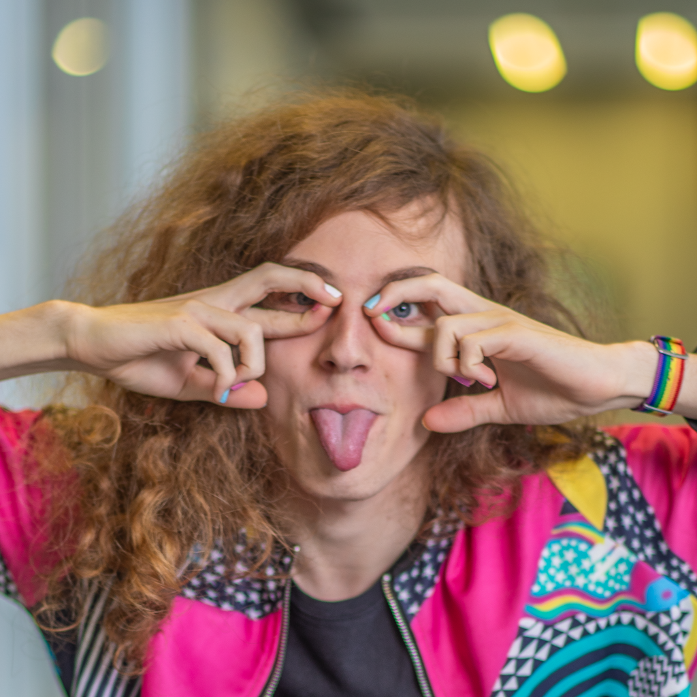

# Hello there ;p I'm Danyella

## About me

- ⌨️ I’m working on [Adadas](https://github.com/movva-gpu/Adadas) and [Grapes](https://github.com/movva-gpu/Grapes)
- 🫱🏻‍🫲🏼 I’m looking to collaborate on [Validity](https://github.com/movva-gpu/Validity) and [Validity-REST](https://github.com/movva-gpu/Validity-REST)
- 📖 I’m currently learning **Svelte and HTMX**
- 📫 Reach me at: **<allenyade.pro@gmail.com>**
- 📞 Fun fact: **I love Doctor Who**

## Socials

## Languages and Tools

## Stats

